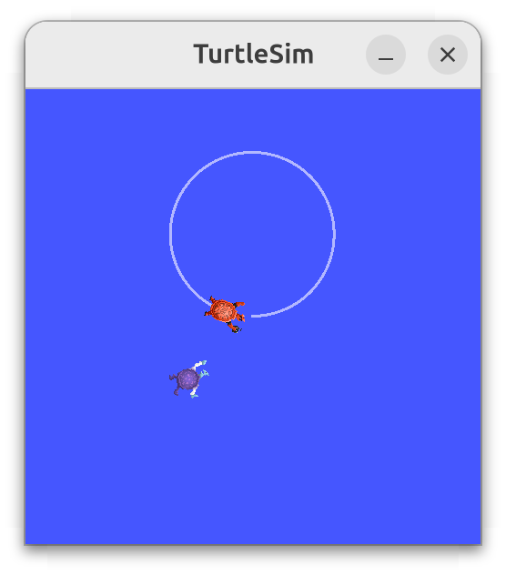

# AUT4 Praktikum: Versuch 1 und 2

## Aufgabenbeschreibung

Ein Roboter soll einen anderen Roboter autonom verfolgen. Hierzu verwenden wir die Simulationsumgebung `turtlesim`:
- **turtle1** wird manuell gesteuert
- **turtle2** berechnet Distanz und Winkel zu turtle1
- **turtle2** rotiert und bewegt sich in Richtung von turtle1
- Die Geschwindigkeit von turtle2 hängt von der Entfernung ab



## Vorbedingungen

- ROS2 installiert
- Turtlesim-Node läuft (`ros2 run turtlesim turtlesim_node`)
- Zwei Schildkröten instanziiert: turtle1 und turtle2

### Setup Turtlesim

```bash
# Terminal 1: Turtlesim starten
ros2 run turtlesim turtlesim_node

# Terminal 2: Manuelle Steuerung von turtle1
ros2 run turtlesim turtle_teleop_key

# Terminal 3: turtle2 hinzufügen
ros2 service call /spawn turtlesim/srv/Spawn "{x: 2, y: 2, theta: 0.2, name: 'turtle2'}"
```

## ROS2 Workspace Struktur

Ein ROS2 Workspace besteht aus mehreren Verzeichnissen:

```
ros2_ws/
├── src/
│   └── turtle_pilot/           # Dieses Paket (Quelldateien)
├── build/                      # Build-Artefakte (wird bei colcon build generiert)
├── install/
│   ├── setup.bash              # Setup-Skript
│   └── turtle_pilot/           # Kompilierte Dateien des Paketes
└── log/                        # Build-Logs
```

### Workspace aktivieren mit `source`

Nach dem Build müssen Sie die Workspace-Umgebung laden. Dies wird durch das `setup.bash`-Skript gemacht:

```bash
source install/setup.bash
```

> ⚠️ Der `source`-Befehl muss **in jedem neuen Terminal** ausgeführt werden, bevor Sie ROS2-Befehle verwenden. Dies konfiguriert Umgebungsvariablen, die notwendig sind, damit ROS2 Ihre Pakete findet.

**Tipps:**
- `source` aus dem **Workspace-Root** (`ros2_ws/`) aufrufen
- Nach Änderungen am Code müssen Sie `colcon build` erneut aufrufen
- Nach dem Build müssen Sie gegebenenfalls wieder `source install/setup.bash` ausführen

## ROS2 Paket erstellen

Ein neues ROS2 Paket wird mit `ros2 pkg create` erstellt:

```bash
cd ros2_ws/src
ros2 pkg create --build-type ament_cmake turtle_pilot
```

Dies erstellt im `src/`-Verzeichnis ein neues Paket `turtle_pilot` mit grundlegender Struktur:
- `CMakeLists.txt` - Build-Konfiguration
- `package.xml` - Paket-Metadaten und Abhängigkeiten
- `src/` und `include/` - Verzeichnisse für Source-Code

> ⚠️ Der `ros2 pkg create`-Befehl muss **im `src/`-Verzeichnis** des Workspaces ausgeführt werden.

## Implementierungshinweise

### Zu abonnierende Topics
- `/turtle1/pose` - Position und Ausrichtung von turtle1
- `/turtle2/pose` - Position und Ausrichtung von turtle2

### Winkelberechnung
- **Verwenden Sie `atan2()`** für die Winkelberechnung zwischen den Blickrichtungen
- Dies vermeidet Fallunterscheidungen bei trigonometrischen Funktionen
- Drehen Sie turtle2 um den **kleineren der beiden möglichen Winkel** (Links- oder Rechtsdrehung)

### Distanzbasierte Geschwindigkeit
- Geschwindigkeit sollte mit der Distanz skaliert werden
- Wenn turtle1 erreicht, stehen bleiben (Geschwindigkeit = 0)

## Build und Ausführung

```bash
# Im Workspace-Root (ros2_ws/)
cd ros2_ws
colcon build

# Shell-Umgebung laden
source install/setup.bash

# Node ausführen
ros2 run turtle_pilot turtle_pilot_node
```

> ⚠️ Der `colcon build`-Befehl muss **im `ros2_ws/`-Verzeichnis** ausgeführt werden.

## Nützliche ROS2 Befehle

```bash
# Nodes und Topics inspizieren
ros2 node list
ros2 node info <node_name>
ros2 topic list
ros2 topic info <topic_name>
ros2 topic echo <topic_name>

# Nachrichten veröffentlichen (für Tests)
ros2 topic pub /turtle1/cmd_vel geometry_msgs/msg/Twist \
  "{linear: {x: 2.0, y: 0.0, z: 0.0}, angular: {x: 0.0, y: 0.0, z: 0.785}}" -r10

# Services aufrufen
ros2 service list
ros2 service call /spawn turtlesim/srv/Spawn "{x: 2, y: 2, theta: 0.2, name: 'turtle2'}"
```

## Dokumentation

- Minimal example: [ROS2 Tutorials - Publisher & Subscriber (C++)](https://docs.ros.org/en/jazzy/Tutorials/Beginner-Client-Libraries/Writing-A-Simple-Cpp-Publisher-And-Subscriber.html)
- Twist Message Type: [geometry_msgs/msg/Twist](https://docs.ros2.org/foxy/api/geometry_msgs/msg/Twist.html)
- Pose Message Type: [turtlesim/msg/Pose](https://docs.ros2.org/foxy/api/turtlesim/msg/Pose.html)